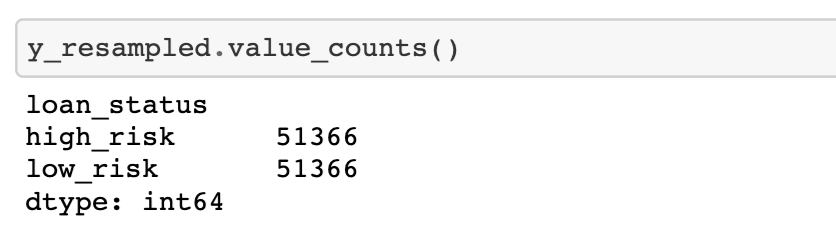
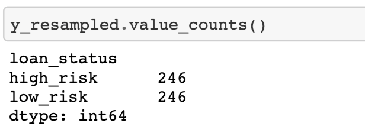
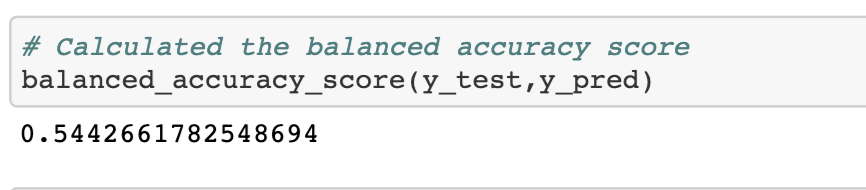
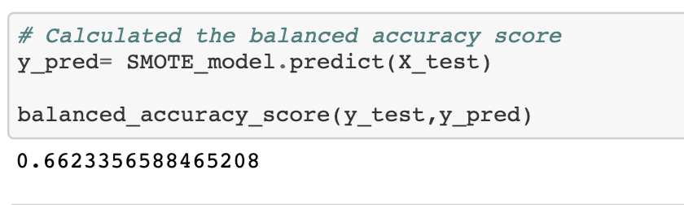
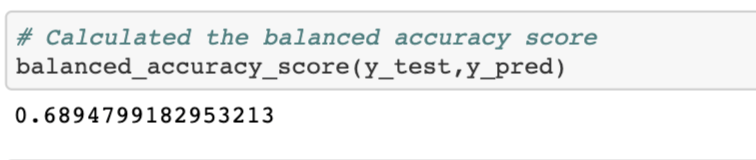
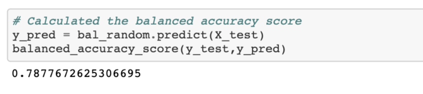

# Credit Risk Analysis

Overview of the loan prediction risk analysis:

The overview of this analysis is to explore oversampling and undersampling. Originally, we saw that there was a lot more samples in one category than the other which meant that the data heavily scewed towards one dataset. Therefore, we performed oversampling and undersampling to balance out the data in each category to perform a more accurate test and train. 

## Results

Accuracy score for oversampling

Accuracy score for undersampling

Accuracy score for undersampling and oversampling combination 

Accuracy score for smote oversampling

Accuracy score for easy ensemble adaboost classifier 

Accuracy score for balanced random forest classifier 

## Summary

After looking at all of these sampling techniques, it is important to realize that the accuracy score for all of these techniques are lower than 70 precent. Also, it is important to note that it is only one percent higher of an accuracy score to undersample than to oversample. From these observations, we can conclude that it would be a wise choice to collect more data to get a higher accuracy score.

